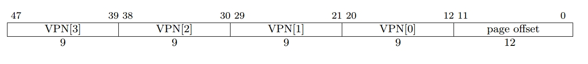
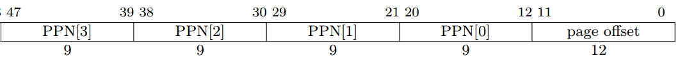
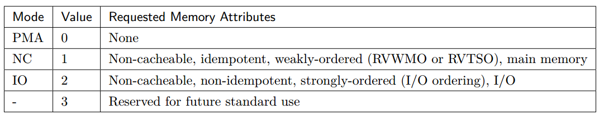
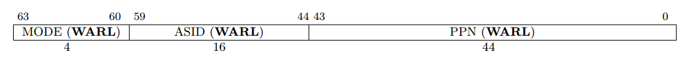
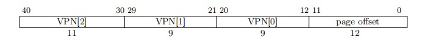
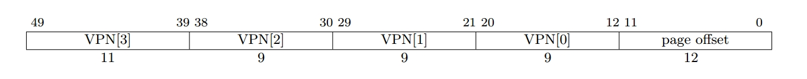
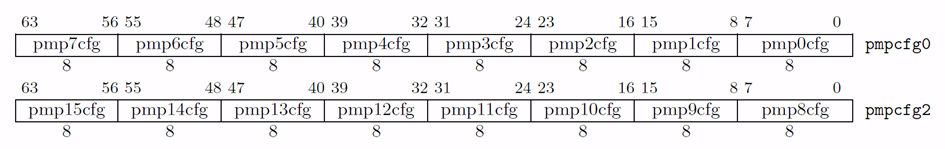

---
file_authors_:
- yimingyan <1650150317@qq.com>
- Yujunjie <yujunjie21@mails.ucas.ac.cn>
---

# 内存模型 {#sec:memory-model}

## 内存模型概述

### 内存属性

{{var_processor_name}} 支持三种内存类型，分别是可高速缓存内存、不可高速缓存内存和不可缓存外设。

地址的物理内存属性（Physical Memory Attributes）由硬件规定，其支持 RISC-V 手册中所规定的属性：

* R（Read Permission）：可读权限
* W（Write Permission）：可写权限
* X（Execute Permission）：可执行权限
* A（Address matching mode）：地址匹配模式
* L（Lock Bit）：锁定状态

同时 {{var_processor_name}} 还支持 atomic（支持原子指令）属性和 c（支持高速缓存）属性。

### 内存一致性模型

可高速缓存内存采用 RVWMO（RISC-V Weak Memory Ordering）内存模型。在该模型下，多核之间内存实际的读写顺序和程序给定的访问顺序会不一致。因此 RISC-V 的指令集架构中提供了 Fence 指令来保证内存访问的同步。同时 RISC-V 的 A 扩展中还提供了 LR/SC 指令和 AMO 指令来进行加锁和原子操作。

不可高速缓存内存和不可缓存外设两种内存类型都是强有序（strongly ordered）的。

## 虚拟内存管理

### MMU 概述

{{var_processor_name}} MMU（Memory Management Unit） 支持 RISC-V SV48 和 SV39 分页机制。其作用主要有：

- 地址转换：将虚拟地址（48 或 39 位）转换为物理地址（48 位）；
- 页面保护：对页面的访问者进行读/写/执行权限的检查；
- 虚拟化支持：支持虚拟化环境下通过两阶段地址翻译将客户机虚拟地址转换为主机物理地址；
- 异常处理：各模块根据请求来源返回异常。

### TLB 组织形式

MMU 主要利用 TLB（Translation Look-aside Buffer）来实现地址转换等功能。TLB 将 CPU 访存使用多个虚拟地址作为输入，转换前检查 TLB 的页面属性，再输出该虚拟地址对应的物理地址。

{{var_processor_name}} MMU 采用两级 TLB 的组织结构，第一级为 L1 TLB，分别为指令 ITLB 与数据 DTLB；第二级为 L2 TLB。

L1 ITLB 的项配置如下表

| **项名** | **项数** | **组织结构** | **替换算法** | **存储内容** |
| --- | --- | --- | --- | --- |
| Page | 48 | 全相联 | PLRU | 全部大小页 |

L1 DTLB 的项配置如下表

| **项名** | **项数** | **组织结构** | **替换算法** | **存储内容** |
| --- | --- | --- | --- | --- |
| Page | 48 | 全相联 | PLRU | 全部大小页 |

取指请求、加载与存储请求在访问 ITLB 与 DTLB 时，如果命中，在下一拍可以得到物理地址与对应权限属性。

L2 TLB 为指令和数据共用，L2 TLB 包含六个主要单元：

1. Page Cache：缓存页表，Sv48 的 4 层页表全部且分开缓存，可以一拍完成 4 层信息的查询。另外，对于虚拟化的请求，Page Cache 会分开存储第一阶段（va -> gpa）和第二阶段（gpa -> hpa）的请求，不会直接存储 va -> hpa 的映射。
2. Page Table Walker：查询内存中的前两级页表；
3. Last Level Page Table Walker：查询内存中的最后一级页表；
4. Hypervisor Page Table Walker：负责查询第二阶段的页表转换
5. Miss Queue：缓存查询 Page Cache 和 Last Level Page Walker 的 miss 请求；
6. Prefetcher：预取器。

### 地址转换流程

MMU 负责将虚拟地址翻译成物理地址，并用翻译得到的物理地址进行访存。 {{var_processor_name}} 支持 Sv39/Sv48 分页机制，虚拟地址长度为 39/48 位，低 12 位是页内偏移，支持 Sv39 时高 27 位分为三段（每段 9 位），也就是三级页表，支持 Sv48 时高 36 位分为四段（每段 9 位），也就是四级页表。

 {{var_processor_name}} 的物理地址为 48 位，虚拟地址和物理地址的结构如图所示。遍历页表需要进行四次内存访问，需要通过 TLB 对页表做缓存。

在进行地址翻译时，前端取指通过 ITLB 进行地址翻译，后端访存通过 DTLB 进行地址翻译。ITLB 和 DTLB 如果 miss，会通过 Repeater 向 L2 TLB 发送请求。前端取指和后端访存对 TLB 均采用非阻塞式访问，如果 TLB 返回缺失，可以重新调度查询其他请求。

{{var_processor_name}} 页表用于存储下级页表的入口地址或者最终页表的物理信息，页表结构如图 6.3 所示：

{{var_processor_name}} 页表结构各 bit 属性：

**PBMT：Page-Based Memory Types**

PBMT 位表示虚拟地址的 PMA 属性，具体定义按场景划分，如图所示。（注：此功能需要开启
menvcfg 寄存器的 PBMTE 位）

- PMA 模式兼容原来未定义虚拟地址 PMA 时的系统属性设定，遵循原物理地址 PMA 属性，即 sysmap 属性；
- NC 模式下，强制覆盖不可缓存、幂等、弱排序属性，一般用于主存；
- IO 模式下，强制覆盖不可缓存、不幂等、强排序属性，一般用于外设；
- PBMT 位为 3 时的情况为保留模式，未来进行定义。
- SVPBMT 中未涉及到的 PMA 属性，以原来物理地址的 PMA 为准，强制覆盖的属性，以 PBMT 为
准。

**RSW：Reserved for use by Supervisor softWare**

给特权态软件保留的页表属性位，硬件不做处理。

**D：Dirty bit :** 表示页面自上次清除 D 位以来是否被写入。

**A：Access bit:** 表示页面自上次清除 A 位以来是否被访问（包括访存和取指）。

**G：Global bit:** 表示页面作用于全局。

**U：User bit:** 表示页面为 User 态专用。

**X：Executable bit:** 表示页面可执行。

**W：Writeable bit:** 表示页面可写。

**R：Readable bit:** 表示页面可读。

**V：Valid bit:** 表示页面有效。

{{var_processor_name}} 支持 Svade 拓展，如果页面在没有设置 A 位的情况下被访问（访存或取指），或者页面在没有设置 D 位的情况下被写入，都会触发 page fault。不支持 Svadu 拓展，不会硬件更新 A/D 位。

地址转换的详细流程描述如下，此处以 Sv39 为例：

CPU 要访问某个虚拟地址，若 TLB 命中，则从 TLB 中直接获取物理地址及相关属性。若 TLB 缺失，
则地址的转换具体步骤为：

1. 根据 SATP.PPN 和 VPN[2] 得到一级页表访存地址 {SATP.PPN, VPN[2], 3’b0}，使用该地址访问 L2 Cache，得到 64-bit 一级页表 PTE;
2. 检查 PTE 是否符合 PMP 权限，若不符合则产生相应 access fault 异常；若符合则根据规则判断 X/W/R 位是否符合叶子页表条件，若符合叶子页表条件则说明已经找到最终物理地址，到
第 3 步；若不符合则回到第 1 步，使用 pte.ppn 代替 satp.ppn，vpn 换为下一级 vpn，再拼接 3'b0 继续第一步流程；
3. 找到了叶子页表，结合 PMP 中的 X/W/R/L 位和 PTE 中的 X/W/R 位得到两者的最小权限进行权
限检查，并将 PTE 的内容回填到 L2 TLB 中；
4. 在任何一步的 PMP 检查中，如果有权限违反，则根据访问类型产生对应的 access fault 异常；
5. 若得到叶子页表，但：访问类型违反 A/D/X/W/R/U-bit 的设置，产生对应的 page fault 异常；若三次访问结束仍未得到叶子页表，则产生对应的 page fault 异常；若访问 L2 Cache 过程中得到 access fault 响应，产生 page fault 异常；
6. 若得到叶子页表，但访问次数少于 3 次，则说明得到了大页表。检查大页表的 PPN 是否按照页表尺寸对齐，若未对齐，则产生 page fault 异常。

这里额外说明，{{var_processor_name}} 不允许访问建立在 MMIO 地址空间的页表。如果在页表遍历过程中，查询得到某级页表的地址位于 MMIO 空间中，会上报 access fault 异常。

### 虚拟化两阶段地址转换

{{var_processor_name}} 支持 H 拓展，在非虚拟化模式且未执行虚拟化访存指令时，地址翻译过程与未加入 H 拓展时基本一致，在虚拟化模式或者执行虚拟化访存指令时，需要判断是否开启两阶段地址翻译。

CPU 根据 vsatp 与 hgatp 开启两阶段翻译，vsatp 结构如下图所示（ {{var_processor_name}} 中 SXLEN 固定为 64）

vsatp 控制 VS-stage 阶段翻译，一般默认 vsatp 保持开启，即在虚拟化模式或者执行虚拟化访存指令时，默认开启 VS-stage 阶段地址翻译。

hgatp 控制 G-stage 阶段翻译，hgatp 结构与翻译模式如下图所示

| **位**  | **域** | **描述**                                                       |
| ------- | ------ | :------------------------------------------------------------ |
| [63:60] | MODE   | 表示地址转换的模式。该域为 0 时为 Bare mode，不开启地址翻译或地址保护，该域为 8/9 时表示 Sv39x4/Sv48x4 地址转换模式，如果该域为其他值会上报 illegal instruction fault |
| [57:44] | VMID   | 虚拟机标识符。对于 {{var_processor_name}} 采用的 Sv39x4/Sv48x4 地址转换模式，VMID 长度最大值都为 14 |
| [43:0]  | PPN    | 表示第二阶段翻译的根页表的物理页号，由物理地址右移 12 位得到 |

{{var_processor_name}} 使用 Sv39x4/Sv48x4 分页机制，两机制的虚拟地址结构如下图所示

VS-stage 负责将客户机虚拟地址转换成客户机物理地址，G-stage 负责将客户机的物理地址转换成主机的物理地址。第一阶段的翻译和非虚拟化的翻译过程基本一致，第二阶段的翻译在 PTW 与 LLPTW 模块中进行，查询逻辑为：首先在 Page Cache 中查找，如果找到则返回给 PTW 或者 LLPTW，如果没找到就进入 HPTW 进行翻译，由 HPTW 返回并填入 Page Cache。

在两阶段地址翻译中，第一阶段翻译得到的地址（包括翻译过程中计算得到的页表地址）均为客户机的物理地址，需要进行第二阶段翻译得到真实的物理地址后才能进行访存读取页表。逻辑上的 Sv39x4 与 Sv48x4 翻译过程如下图所示。

### 系统控制寄存器

**MMU 地址转换寄存器（SATP）**

{{var_processor_name}} 架构支持长度为 16 的 ASID（地址空间标识符），在 SATP 寄存器中保存。SATP 寄存器的格式如表所示。

| **位**  | **域** | **描述**                                                       |
| ------- | ------ | :------------------------------------------------------------ |
| [63:60] | MODE | 表示地址转换的模式。该域为 0 时为 Bare mode，不开启地址翻译或地址保护，该域为 8/9 时表示 Sv39/Sv48 地址转换模式，如果该域为其他值会上报 illegal instruction fault |
| [59:44] | ASID | 地址空间标识符。ASID 的长度可参数化配置，对于 {{var_processor_name}} 采用的 Sv39/Sv48 地址转换模式，ASID 长度最大值为 16 |
| [43:0] | PPN | 表示根页表的物理页号，由物理地址右移 12 位得到 |

在虚拟化模式下，SATP 将被 VSATP 寄存器代替，并且其中的PPN为客户机根页表的客户机物理页号，而非真实的物理地址，需要进行第二阶段翻译才能得到真实物理地址。

## 物理内存保护&物理地址属性

### PMP概述

{{var_processor_name}} 遵从 RISC-V 标准。PMP（Physical Memory Protection）单元负责对物理地址的访问权限进行检查，判定当前工作模式下 CPU 是否具备对该地址的读/写/执行权限。

PMA（Physical Memory Attributes）单元的作用是定义物理内存的属性。它主要负责指定内存区域的类型，定义内存访问特性与控制内存访问的行为。

PMA 与 PMP 配合使用，共同管理和控制物理内存的访问和属性，确保系统的安全性和性能。

{{var_processor_name}} PMP&PMA 单元的设计规格有：

- 支持物理地址保护；
- 支持物理地址属性；
- 支持 PMP&PMA 并行执行检查；
- 支持分布式 PMP 与分布式 PMA；
- 支持异常处理。

### PMP 控制寄存器

{{var_processor_name}} 默认 PMP 为 16 项，可以通过参数化修改，采用分布复制式实现方法。PMP 表项主要由一个 8bit 的配置寄存器与一个 64bit 的地址寄存器构成，默认没有初始值。

PMP 寄存器的地址空间如下表

| **PMP寄存器名** | **地址** |
| --- | --- |
| pmpcfg0 | 0x3A0 |
| pmpcfg2 | 0x3A2 |
| pmpaddr0 | 0x3B0 |
| pmpaddr1 | 0x3B1 |
| pmpaddr2 | 0x3B2 |
| pmpaddr3 | 0x3B3 |
| pmpaddr4 | 0x3B4 |
| pmpaddr5 | 0x3B5 |
| pmpaddr6 | 0x3B6 |
| pmpaddr7 | 0x3B7 |
| pmpaddr8 | 0x3B8 |
| pmpaddr9 | 0x3B9 |
| pmpaddr10 | 0x3BA |
| pmpaddr11 | 0x3BB |
| pmpaddr12 | 0x3BC |
| pmpaddr13 | 0x3BD |
| pmpaddr14 | 0x3BE |
| pmpaddr15 | 0x3BF |

其中，PMP 配置寄存器 pmpcfg0，pmpcfg2 的布局如图所示

PMP 配置寄存器的格式如下表

| **位**  | **域** | **描述**                                                       |
| ------- | ------ | :------------------------------------------------------------ |
| 7 | L | 表示该 PMP 表项是否被锁定。该域默认为 0，表示未被锁定；为 1 时表示被锁定，需复位才可解除 |
| [6:5] | 保留 | 保留位，默认为 0 |
| [4:3] | A | 表示该 PMP 表项的地址匹配模式。该域默认为 0，表示 PMP 表项被禁用且不匹配任何地址。该域为 1、2、3 时分别表示 TOR、NA4、NAPOT 地址匹配模式 |
| 2 | X | 表示该 PMP 表项配置的地址是否支持指令执行。该域为 1 时表示支持指令执行，为 0 时不支持指令执行 |
| 1 | W | 表示该 PMP 表项配置的地址是否支持写。该域为 1 时表示支持写，为 0 时不支持写 |
| 0 | R | 表示该 PMP 表项配置的地址是否支持读。该域为 1 时表示支持读，为 0 时不支持读 |

PMP 地址寄存器的格式如下表

| **位** | **域** | **描述** |
| --- | --- | --- |
| [63:34] | 0 | PMP 地址寄存器的高 30 位为 0 |
| [33:0] | address | 存储 PMP 表项配置的地址的 [35:2] 位 |

### PMA 属性寄存器

PMA 的实现采用类似 PMP 的方式，PMA 寄存器默认拥有初始值， 需手动设置与平台地址属性一致。PMA 寄存器利用了 M 态 CSR 的保留寄存器地址空间，默认为 16 项。

PMA 寄存器的地址空间如下表

| **PMA寄存器名** | **地址** | **复位值** |
| --- | --- | --- |
| pmacfg0 | 0x7C0 | 64'h80b080d08000000 |
| pmacfg2 | 0x7C2 | 64'h6f0b080b080f080b |
| pmaaddr0 | 0x7C8 | 64'h0 |
| pmaaddr1 | 0x7C9 | 64'h0 |
| pmaaddr2 | 0x7CA | 64'h0 |
| pmaaddr3 | 0x7CB | 64'h4000000 |
| pmaaddr4 | 0x7CC | 64'h8000000 |
| pmaaddr5 | 0x7CD | 64'hc000000 |
| pmaaddr6 | 0x7CE | 64'hc4c4000 |
| pmaaddr7 | 0x7CF | 64'he000000 |
| pmaaddr8 | 0x7D0 | 64'he004000 |
| pmaaddr9 | 0x7D1 | 64'he008000 |
| pmaaddr10 | 0x7D2 | 64'he008400 |
| pmaaddr11 | 0x7D3 | 64'he400000 |
| pmaaddr12 | 0x7D4 | 64'he400800 |
| pmaaddr13 | 0x7D5 | 64'hf000000 |
| pmaaddr14 | 0x7D6 | 64'h20000000 |
| pmaaddr15 | 0x7D7 | 64'h120000000 |

其中，pmacfg0、pmacfg2 的布局如图所示

PMA 配置寄存器的格式如下表

| **位**  | **域** | **描述**                                                       |
| ------- | ------ | :------------------------------------------------------------ |
| 7 | L | 表示该 PMA 表项是否被锁定。该域默认为 0，表示未被锁定；为 1 时表示被锁定 |
| 6 | C | 表示该 PMA 表项配置的地址是否可缓存。该域为 1 时表示可缓存，为 0时表示该地址属于 mmio 空间，不可缓存 |
| 5 | Atomic | 表示该 PMA 表项配置的地址是否允许原子访问。该域为 1 时表示可原子访问，为 1 时表示不可原子访问 |
| [4:3] | A | 表示该 PMA 表项的地址匹配模式。该域默认为 0，表示 PMA 表项被禁用且不匹配任何地址。该域为 1、2、3 时分别表示 TOR、NA4、NAPOT 地址匹配模式 |
| 2 | X | 表示该 PMA 表项配置的地址是否支持指令执行。该域为 1 时表示支持指令执行，为 0 时不支持指令执行 |
| 1 | W | 表示该 PMA 表项配置的地址是否支持写。该域为 1 时表示支持写，为 0 时不支持写 |
| 0 | R | 表示该 PMA 表项配置的地址是否支持读。该域为 1 时表示支持读，为 0 时不支持读 |

PMA 地址寄存器的格式如下表

| **位** | **域** | **描述** |
| --- | --- | --- |
| [63:34] | 0 | PMA 地址寄存器的高 30 位为 0 |
| [33:0] | address | 存储 PMA 表项配置的地址的 [35:2] 位 |

PMA 寄存器描述的地址空间及属性如下表

| **地址下界**   | **地址上界**   | **描述**        | **属性** |
| -------------- | -------------- | --------------- | -------- |
| 0x00_0000_0000 | 0x00_0FFF_FFFF | Reserved        |          |
| 0x00_1000_0000 | 0x00_1FFF_FFFF | QSPI Flash      | RX       |
| 0x00_2000_0000 | 0x00_2FFF_FFFF | Reserved        |          |
| 0x00_3000_0000 | 0x00_3000_FFFF | GPU(V550)       | RW       |
| 0x00_3001_0000 | 0x00_3001_FFFF | G71             | RW       |
| 0x00_3002_0000 | 0x00_3003_FFFF | Reserved        |          |
| 0x00_3004_0000 | 0x00_3004_FFFF | DMA             | RW       |
| 0x00_3005_0000 | 0x00_3005_FFFF | SDMMC           | RW       |
| 0x00_3006_0000 | 0x00_3015_FFFF | USB             | RW       |
| 0x00_3016_0000 | 0x00_3025_FFFF | DATA_CPU_BRIDGE | RW       |
| 0x00_3026_0000 | 0x00_30FF_FFFF | Reserved        |          |
| 0x00_3100_0000 | 0x00_3100_FFFF | QSPI            | RW       |
| 0x00_3101_0000 | 0x00_3101_FFFF | GMAC            | RW       |
| 0x00_3102_0000 | 0x00_3102_FFFF | HDMI            | RW       |
| 0x00_3103_0000 | 0x00_3103_FFFF | HDMI_PHY        | RW       |
| 0x00_3104_0000 | 0x00_3105_FFFF | DP              | RW       |
| 0x00_3106_0000 | 0x00_3106_FFFF | DDR0            | RW       |
| 0x00_3107_0000 | 0x00_3107_FFFF | DDR0_PHY        | RW       |
| 0x00_3108_0000 | 0x00_3108_FFFF | DDR1            | RW       |
| 0x00_3109_0000 | 0x00_3109_FFFF | DDR1_PHY        | RW       |
| 0x00_310A_0000 | 0x00_310A_FFFF | IIS             | RW       |
| 0x00_310B_0000 | 0x00_310B_FFFF | UART0           | RW       |
| 0x00_310C_0000 | 0x00_310C_FFFF | UART1           | RW       |
| 0x00_310D_0000 | 0x00_310D_FFFF | UART2           | RW       |
| 0x00_310E_0000 | 0x00_310E_FFFF | IIC0            | RW       |
| 0x00_310F_0000 | 0x00_310F_FFFF | IIC1            | RW       |
| 0x00_3110_0000 | 0x00_3110_FFFF | IIC2            | RW       |
| 0x00_3111_0000 | 0x00_3111_FFFF | GPIO            | RW       |
| 0x00_3112_0000 | 0x00_3112_FFFF | CRU             | RW       |
| 0x00_3113_0000 | 0x00_3113_FFFF | WDT             | RW       |
| 0x00_3114_0000 | 0x00_3114_FFFF | USB2_PHY0       | RW       |
| 0x00_3115_0000 | 0x00_3115_FFFF | USB2_PHY1       | RW       |
| 0x00_3116_0000 | 0x00_3116_FFFF | USB2_PHY2       | RW       |
| 0x00_3117_0000 | 0x00_3117_FFFF | USB2_PHY3       | RW       |
| 0x00_3118_0000 | 0x00_3118_FFFF | USB3_PHY0       | RW       |
| 0x00_3119_0000 | 0x00_3119_FFFF | USB3_PHY1       | RW       |
| 0x00_311a_0000 | 0x00_311a_FFFF | USB3_PHY2       | RW       |
| 0x00_311b_0000 | 0x00_311b_FFFF | USB3_PHY3       | RW       |
| 0x00_311c_0000 | 0x00_311c_FFFF | PCIE0_CFG       | RW       |
| 0x00_311d_0000 | 0x00_311d_FFFF | PCIE1_CFG       | RW       |
| 0x00_311e_0000 | 0x00_311e_FFFF | PCIE2_CFG       | RW       |
| 0x00_311f_0000 | 0x00_311f_FFFF | PCIE3_CFG       | RW       |
| 0x00_3120_0000 | 0x00_3120_FFFF | SYSCFG          | RW       |
| 0x00_3121_0000 | 0x00_3130_FFFF | DATA_CPU_BRIDGE | RW       |
| 0x00_3131_0000 | 0x00_37FF_FFFF | Reserved        |          |
| 0x00_3800_0000 | 0x00_3800_FFFF | CLINT (In cpu)  | RW       |
| 0x00_3801_0000 | 0x00_3801_FFFF | Reserved        |          |
| 0x00_3802_0000 | 0x00_3802_0FFF | Debug (In cpu)  | RW       |
| 0x00_3802_1000 | 0x00_38FF_FFFF | Reserved        |          |
| 0x00_3900_0000 | 0x00_3900_0FFF | CacheCtrl       | RW       |
| 0x00_3900_1000 | 0x00_3900_1FFF | Core Reset      | RW       |
| 0x00_3900_2000 | 0x00_3BFF_FFFF | Reserved        |          |
| 0x00_3C00_0000 | 0x00_3FFF_FFFF | PLIC (In cpu)   | RW       |
| 0x00_4000_0000 | 0x00_4FFF_FFFF | PCIe0           | RW       |
| 0x00_5000_0000 | 0x00_5FFF_FFFF | PCIe1           | RW       |
| 0x00_6000_0000 | 0x00_6FFF_FFFF | PCIe2           | RW       |
| 0x00_7000_0000 | 0x00_7FFF_FFFF | PCIe3           | RW       |
| 0x00_8000_0000 | 0x1F_FFFF_FFFF | DDR             | RWXIDSA  |

PMA 寄存器的条目信息如下表

| **地址**    | **c** | **atomic** | **a** | **x** | **w** | **r** |
| ----------- | ----- | ---------- | ----- | ----- | ----- | ----- |
| 0x0         | false | false      | 0     | false | false | false |
| 0x0         | false | false      | 0     | false | false | false |
| 0x0         | false | false      | 0     | false | false | false |
| 0x10000000  | false | false      | 1     | false | false | false |
| 0x20000000  | false | false      | 1     | true  | false | true  |
| 0x30000000  | false | false      | 1     | false | false | false |
| 0x31310000  | false | false      | 1     | false | true  | true  |
| 0x38000000  | false | false      | 1     | false | false | false |
| 0x38010000  | false | false      | 1     | false | true  | true  |
| 0x38020000  | false | false      | 1     | false | false | false |
| 0x38021000  | false | false      | 1     | true  | true  | true  |
| 0x39000000  | false | false      | 1     | false | false | false |
| 0x39002000  | false | false      | 1     | false | true  | true  |
| 0x3c000000  | false | false      | 1     | false | false | false |
| 0x80000000  | false | false      | 1     | false | true  | true  |
| 0x480000000 | true  | true       | 1     | true  | true  | true  |

## 异常处理机制

{{var_processor_name}} MMU 模块可能产生 4 种异常，包括 guest page fault、page fault、access fault以及 L2 TLB page cache 的 ECC 校验出错。根据请求来源分别交付给对应模块处理。

MMU 可能产生的异常以及处理流程如下表

| **模块** | **可能产生的异常**          | **处理流程**                                            |
| -------- | --------------------------- | ------------------------------------------------------- |
| ITLB     |                             |                                                         |
|          | 产生 inst page fault        | 根据请求来源，分别交付给 Icache 或 IFU 处理             |
|          | 产生 inst guest page fault  | 根据请求来源，分别交付给 Icache 或 IFU 处理             |
|          | 产生 inst access fault      | 根据请求来源，分别交付给 Icache 或 IFU 处理             |
| DTLB     |                             |                                                         |
|          | 产生 load page fault        | 交付给 LoadUnits 进行处理                               |
|          | 产生 load guest page fault  | 交付给 LoadUnits 进行处理                               |
|          | 产生 store page fault       | 根据请求来源，分别交付给 StoreUnits 或 AtomicsUnit 处理 |
|          | 产生 store guest page fault | 根据请求来源，分别交付给 StoreUnits 或 AtomicsUnit处理  |
|          | 产生 load access fault      | 交付给 LoadUnits 进行处理                               |
|          | 产生 store access fault     | 根据请求来源，分别交付给 StoreUnits 或 AtomicsUnit 处理 |
| L2 TLB   |                             |                                                         |
|          | 产生 guest page fault       | 交付给 L1 TLB，L1 TLB 根据请求来源交付处理              |
|          | 产生 page fault             | 交付给 L1 TLB，L1 TLB 根据请求来源交付处理              |
|          | 产生 access fault           | 交付给 L1 TLB，L1 TLB 根据请求来源交付处理              |
|          | ecc 校验出错                | 无效掉当前项，返回 miss 结果并重新进行 Page Walk        |

另外，根据 RISC-V 手册，Page Fault 的优先级高于 Access Fault，但是如果 Page Table Walk 过程中，出现了 PMP 检查或 PMA 检查的 Access Fault，此时页表项为非法，会发生 Page Fault 和 Access Fault 一起出现的特殊情况， {{var_processor_name}} 选择报 Access Fault。其余情况下均满足 Page Fault 的优先级高于Access Fault。

## 内存访问顺序

在不同的场景下， {{var_processor_name}} 对地址空间的访问过程不同，简要归纳如下：

场景1：CPU 不进行 VA-PA 转换

- CPU 要访问 PA；
- 查找地址属性；
- PMP 检查，确认地址读写执行权限；
- 执行地址访问。

场景2：非虚拟化环境下进行 VA-PA 转换

- CPU 要访问 VA；
- 通过 MMU 进行地址翻译，得到页表项；
- 根据 PTE 查找地址、属性与权限信息；
- PMP 检查，确认地址读写执行权限；
- 执行地址访问。

场景3：虚拟化环境下进行 VA-PA 转换

- CPU 要访问客户机 VA；
- 查看虚拟化寄存器确认两阶段地址翻译是否开启；
- MMU 进行两阶段地址翻译，得到页表项；
- 根据 PTE 查找地址、属性与权限信息；
- PMP 检查，确认地址读写执行权限；
- 执行地址访问。
